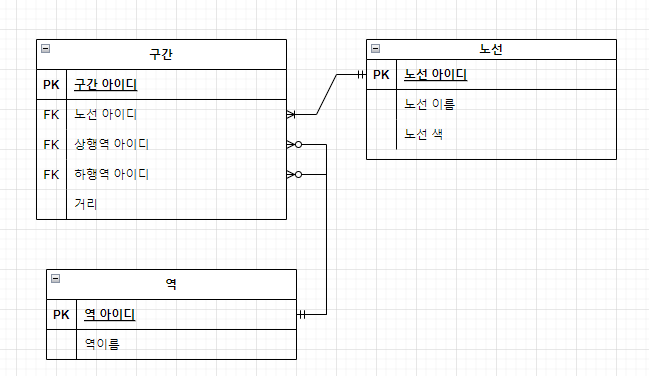

# 지하철 노선도 미션
[ATDD 강의](https://edu.nextstep.camp/c/R89PYi5H) 실습을 위한 지하철 노선도 애플리케이션

# ERD

- 구간 N : 역 1
  - 구간은 역을 반드시 가져야 한다
  - 역은 구간을 가질수도 있고 안 가질 수 도 있다
- 노선 1 : 구간 N
  - 노선은 구간을 반드시 가져야 한다
  - 구간은 역을 반드시 가져야 한다
