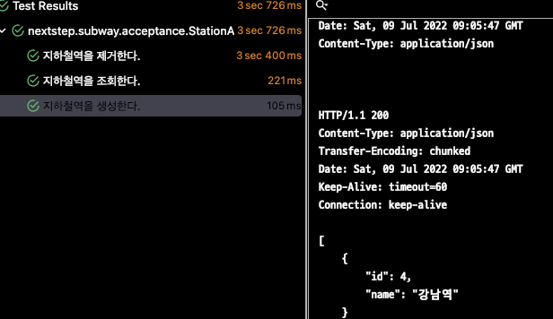

# 지하철 노선도 미션
[ATDD 강의](https://edu.nextstep.camp/c/R89PYi5H) 실습을 위한 지하철 노선도 애플리케이션

## 1주차

### 요구사항
- 지하철역 인수 테스트 완성해보기
  - [x] 지하철역 목록 조회 인수 테스트 작성하기
  - [x] 지하철역 삭제 인수 테스트 작성하기
  - [x] 메소드 분리 하기

### 문제점

- 제거, 조회, 생성 따로 테스트를 돌리면 정상적으로 작동한다.
- test Class 전체를 돌리게 되면, 에러가 발생한다.
- 원인: 다른 테스트케이스가 다른곳에 영향을 줘서 발생


#### 해결하는 과정

1. 첫번쨰

```@DirtiesContext 사용```


결론부터 말하자면, 성공하였다.  
하지만, 테스트 마다 context를 초기화하여 SpringBoot가 다시 시직되는 불 필요함이 있다.

2. 두번쨰

```@BeforeEach 나 @AfterEach 에서 초기화```



이것도 또한 방법중 하나가 될것이다.  
@DirtiesContext보다는 비용이 떨어지겠지만 데이터가 많아지면 테스트 성능이 떨어질 것이다.

