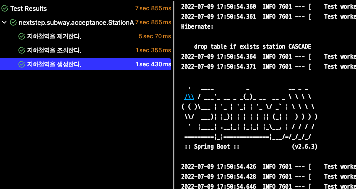

# 지하철 노선도 미션
[ATDD 강의](https://edu.nextstep.camp/c/R89PYi5H) 실습을 위한 지하철 노선도 애플리케이션

## 1주차

### 요구사항
- 지하철역 인수 테스트 완성해보기
  - [x] 지하철역 목록 조회 인수 테스트 작성하기
  - [x] 지하철역 삭제 인수 테스트 작성하기
  - [x] 메소드 분리 하기

### 문제점

- 제거, 조회, 생성 따로 테스트를 돌리면 정상적으로 작동한다.
- test Class 전체를 돌리게 되면, 에러가 발생한다.
- 원인: 다른 테스트케이스가 다른곳에 영향을 줘서 발생


#### 해결하는 과정

1. 첫번쨰

```@DirtiesContext 사용```



결론부터 말하자면, 성공하였다.  
하지만, 테스트 마다 context를 초기화하여 SpringBoot가 다시 시직되는 불 필요함이 있다.

2. 두번쨰

```@BeforeEach 나 @AfterEach 에서 초기화```


이것도 또한 방법중 하나가 될것이다.  
@DirtiesContext보다는 비용이 떨어지겠지만 데이터가 많아지면 테스트 성능이 떨어질 것이다.

3. 세번쨰

```@sql 사용```


@SQL을 이용하여 truncate sql을 사용하여 해결할 수 있다.
delete 보다 truncate 가 트랜잭션 로그 공간도 차지 하지 않고, 락도 걸리지 않아 이중에서 제일 좋은 방법이라고 생각하였습니다.


## 2주차

- 지하철 노선 기능 구현하기
  - [x] 지하철 노선 생성하기
  - [x] 지하철 노선 목록 조회
  - [x] 지하철 노선 조회
  - [x] 지하철 노선 수정
  - [x] 지하철 노선 삭제

- 테스트 코드 작성하기
  - [x] 지하철 노선 생성하기 테스트 코드 작성
  - [x] 지하철 노선 목록 조회 테스트 코드 작성
  - [x] 지하철 노선 조회 테스트 코드 작성
  - [x] 지하철 노선 수정 테스트 코드 작성
  - [x] 지하철 노선 삭제 테스트 코드 작성

### 생각해보기

1주차때 테스트 코드에 서로 영향이 없게 수정을 하였는데, @SQL에도 큰 문제점이 있다.  
table이 늘어 날때 마다 sql을 작성해 줘야 한다.


그래서 Entity를 모두 조회 후, truncate를 하는 방식으로 수정 하였다.