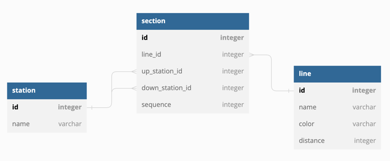
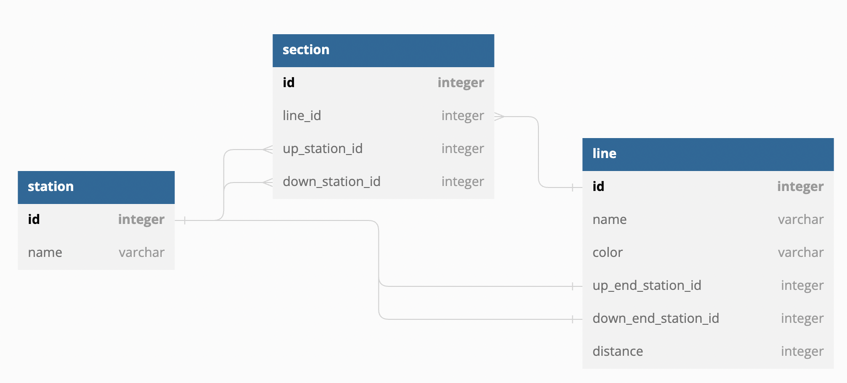

### 삭제를 하행 종점만 할 수 있음에도 불구하고 id를 받아 삭제하도록 한 이유는 무엇일까?
- 예상 이유 : 비즈니스 요구사항 변경에 대비해서 => 그렇다면 API 설계할 때는 비즈니스 요구사항을 어떻게 반영해야 할까? 반영하지 말아야 할까?
- action-oriented가 아닌 resource-oriented가 유리한 이유는 비즈니스 변경에도 강해서?

### ERD 설계 1 (채택)

### Section에 sequence를 주는게 좋을까?
- 역들은 순서를 가지고 있기 때문에 sequence를 주는게 좋을 것 같다.
  - 찬성 : 어차피 section id를 통해 정렬될 예정.
    - AUTOGEN이 아니라면? pk가 sequential하게 되지도 않을 뿐더러 db 테이블 옵션에 따라서 달라질 것
      - 국내 역 수는 337개(위키백과) => PK로 UUID를 쓸 이유도 없고 추후에도 없을 듯
  - 찬성 : 쿼리할 때 `ORDER BY sequence ASC`로 쿼리해서 읽어오면 애플리케이션에서 정렬할 필요도 없어짐
    - 정렬 작업은 애플리케이션에서 하는게 낫지 않을까? 어차피 역이 가지는 구간 수는 적음
      - 정렬 하더라도 db 부하 적을 것으로 예상됨. 코드 수가 줄어듦
      - DB 부하를 고려한다면 pk로 정렬하는게 낫지 않나? sequential하기 때문에 정렬로 인한 부하가 거의 없을 듯
        - 그렇다면 코드에 비즈니스 명시가 안 되는 건 아닐지? 나중에 마이그레이션할 일이 생기면 빠뜨려서 문제가 발생할지도
          - 그 비즈니스 요구사항에 Station을 응답할 때 역 순으로 정렬하라는 말은 없었는데?
  - 결론 : Section은 내부에서 sequence를 가진다. 비즈니스 로직이 간단해지기 때문. 이로 인한 db 부하도 크지 않은 편

### ERD 설계 2

line에서 종점과 시점을 알고 있는 구조. 이로 인해 line을 조회할 때 section을 조회할 필요가 없어짐
- 그러나 어차피 Stations 호출하므로 section 조회 해야함

