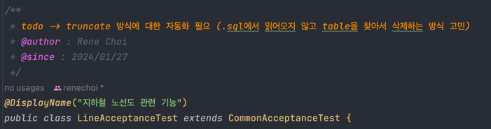

## 1. Test 환경에서 @Sql을 이용한 테이블 초기화시 자동화 전략

### todo 내용 

> todo -> truncate 방식에 대한 자동화 필요 (.sql에서 읽어오지 않고 table을 찾아서 삭제하는 방식 고민)




### 기존 코드 

```java
@Test
@Sql(scripts = {"/cleanup.sql"}, executionPhase = Sql.ExecutionPhase.BEFORE_TEST_METHOD)
@DisplayName("지하철노선 생성")
void createLine(){
        // ... 생략 
}
```

### 변경 

아래와 같은 Helper 클래스를 별도로 구현하여 Table을 동적으로 가져올 수 있도록 하였다. 

```java

@Component
public class DatabaseCleanupExecutor implements InitializingBean {

	@PersistenceContext
	private EntityManager entityManager;
	private List<String> tableNames;
	
	@Override
	public void afterPropertiesSet()  {
		tableNames = entityManager.getMetamodel().getEntities().stream()
			.filter(DatabaseCleanupExecutor::isEntityFound)
			.map(EntityType::getName)
			.collect(Collectors.toList());
	}

	@Transactional
	public void execute(){
		entityManager.flush();
		entityManager.createNativeQuery("SET REFERENTIAL_INTEGRITY FALSE").executeUpdate();
		tableNames.forEach(tableName -> entityManager.createNativeQuery("TRUNCATE TABLE " +  tableName + " RESTART IDENTITY").executeUpdate());
		entityManager.createNativeQuery("SET REFERENTIAL_INTEGRITY TRUE").executeUpdate();
	}

	private static boolean isEntityFound(EntityType<?> entity) {
		return entity.getJavaType().getAnnotation(Entity.class) != null;
	}
}

```


해당 Cleaner Util은 인수 테스트의 공통 기능을 추상화한 공통 클래스에 의해 실행되며, 

실제 구체 클래스는 해당 클래스를 `extends` 하도록 변경하였다. 

```java
@SpringBootTest(webEnvironment = SpringBootTest.WebEnvironment.DEFINED_PORT)
@Component
public class CommonAcceptanceTest {

	@Autowired
	private DatabaseCleanupExecutor databaseCleanupExecutor;

	@BeforeEach
	void databaseCleanup() {
		databaseCleanupExecutor.execute();
	}
}
```


- 기존 방식에서는 '.sql' 파일에 미리 하드코딩으로 테이블을 규정해주어야 했다면 변경 방식에서는 동적으로 테이블을 가져올 수 있다.
- 기존 방식에서는 '.sql' 파일에 테이블에 대한 'Truncate' 쿼리 전후에 실행되는 `SET REFERENTIAL_INTEGRITY FALSE` 구문을 매 테이블에 대해 실행했다. 변경 코드에서는 한 스텝에 대해서 한 차례씩 수행하고, 테이블에 대해서는 Truncate 쿼리만 날리므로 효율성이 개선되었다. 
- 기존 방식에서는 메서드별로 `@Sql`을 붙여야했다면 현재 방식에서는 `@BeforeEach`로 해당 기능을 자동화했다.


